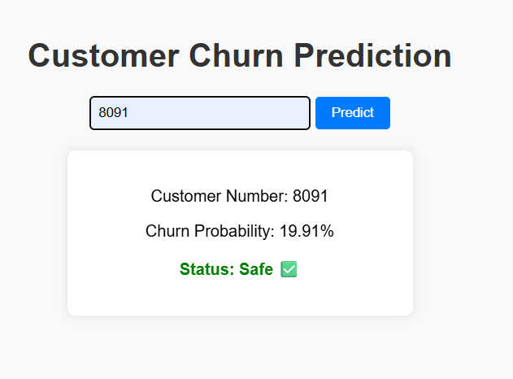

# README.md

# Customer Churn Prediction

A **Flask-based web application** that predicts **customer churn** using machine learning.

**What is Customer Churn?**
Customer churn is the **percentage of customers who stop using a product or service over time**.
For example, if a telecom customer cancels their subscription, they are considered “churned.”
By predicting churn, companies can **identify at-risk customers** and take steps to keep them.

This project allows you to enter a **customer number** and see:

* The probability that the customer will churn
* A simple status: Safe, Medium Risk, or High Risk

---

## Features

* Load customer data from CSV into **MongoDB**.
* Predict churn using a **trained scikit-learn model**.
* Accept **numeric or full alphanumeric customer IDs**.
* Displays:

  * Churn probability
  * Churn status
* Clean and simple **frontend** using HTML, CSS, and light JS.

---

## Tech Stack

* Python 3.x
* Flask (web framework)
* scikit-learn (ML model)
* pandas, numpy (data handling)
* MongoDB (database)
* Joblib (save/load model)
* HTML, CSS, JS (frontend)

---

## Project Structure

```
Churn-Prediction-Project/
├─ src/
│  ├─ app.py                 # Flask backend
│  ├─ load_data_to_mongo.py # Load CSV into MongoDB
│  ├─ EDA.py # EDA plots visuals
│  ├─ trainmodel.py # model training
├─ models/
│  └─ churn_pipeline.joblib  # Trained ML model
├─ templates/
│  └─ index.html             # Frontend page
├─ data/
│  └─ Telco-Customer-Churn.csv
├─ README.md
├─ requirements.txt
```

---

## How to Run

1. **Install Python packages**:

```bash
pip install -r requirements.txt
```
2. **Start MongoDB** (make sure your MongoDB server is running).
3. **Load the data into MongoDB**:
```bash
python src/load_data_to_mongo.py
```
4. **Run the Flask app**:
```bash
python src/app.py
```
5. Open your browser and go to:
```
http://127.0.0.1:5000/
```
6. Enter a **numeric customer ID** and see the prediction.
---

## Screenshots

## Prediction Result


---

## Notes

* The ML model uses **preprocessing + RandomForest/GradientBoosting/LogisticRegression** in a scikit-learn pipeline.
* Numeric customer IDs are supported for easier testing and demo.
* For detailed **EDA plots**, check out my Screenshots.

---

